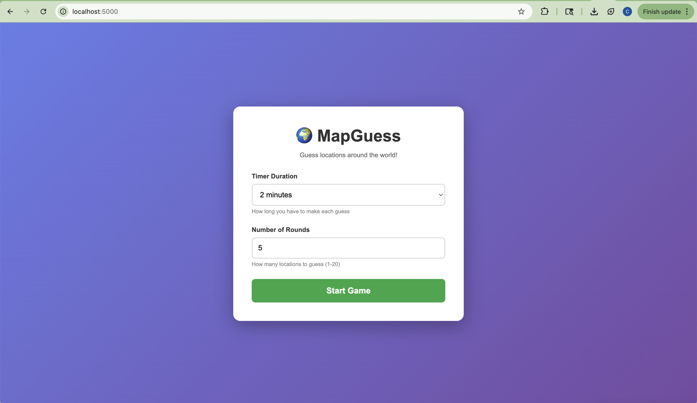
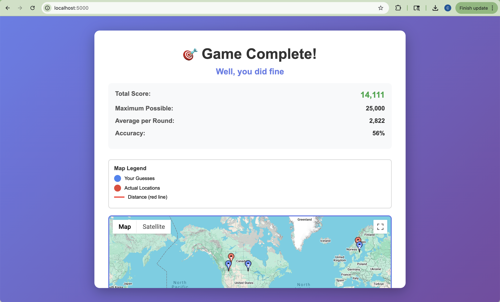

# MapGuess

A simple web-based location guessing game, built with Python Flask and Google Maps API. Explore random locations from around the world, make your guesses, and see how well you can read local clues!

Note that you must set up a Google Maps API key (it is pretty simple and instructions can be found below) and replace `YOUR_API_KEY` in `templates/index.html` with your actual key.

<div style="display: flex; justify-content: space-around; margin-bottom: 20px;">
  
  
  
</div>

## ✨ Features

- ⏱️ Customizable game settings - choose timer duration and number of rounds
- 🌍 Random worldwide locations - new locations every game
- ✅ Automatic Street View verification - only uses locations with valid coverage
- 🗺️ Interactive map for making guesses
- ⏭️ Skip location button - get a new location without penalty
- 📊 Scoring system using Haversine formula (0-5000 points based on accuracy)
- 🎯 Visual feedback showing guess vs actual location
- 🔄 Auto-submit: Click the map and wait, or press "Make Guess" to submit early
- 🏆 End game summary screen - interactive map showing all guesses, stats, and personalized message

## Prerequisites

- Python 3.7 or higher
- Google Maps API key (with Maps JavaScript API and Street View API enabled)

## Quick Start

**IMPORTANT:** Make sure your folder structure is correct! Your MapGuess folder must look like this:

```
MapGuess/
├── app.py              
├── templates/          
│   └── index.html      
├── requirements.txt
├── setup.sh
├── run.sh
└── README.md
```

1. **Open Terminal and navigate to your MapGuess folder:**
   ```bash
   cd ~/Documents/MapGuess
   ```

2. **Run the setup script:**

   (For Mac/Linux)
   ```bash
   chmod +x setup.sh
   ./setup.sh
   ```
   
   (For Windows)
   ```bash
   setup.bat
   ```

3. **Get a Google Maps API key** (see detailed instructions below)

4. **Add your API key** to `templates/index.html` (find the line with `YOUR_API_KEY`)

5. **Start the game:**
   ```bash
   chmod +x run.sh
   ./run.sh
   ```
   Or manually:
   ```bash
   source venv/bin/activate
   python app.py
   ```

   These scripts will automatically create a virtual environment and install all dependencies.

6. **Open your browser** to `http://localhost:5000` and play!

---

## Manual Setup Instructions

**Note:** This assumes your MapGuess folder is located at `~/Documents/MapGuess/`

From your terminal, navigate to the project folder:
```bash
cd ~/Documents/MapGuess
```

### 1. Create a Virtual Environment (Recommended)

It's best practice to use a virtual environment to keep dependencies isolated:

**On Windows:**
```bash
python -m venv venv
venv\Scripts\activate
```

**On Mac/Linux:**
```bash
python3 -m venv venv
source venv/bin/activate
```

You should see `(venv)` in your terminal prompt when activated.

To deactivate later, simply run:
```bash
deactivate
```

### 2. Get a Google Maps API Key

1. Go to [Google Cloud Console](https://console.cloud.google.com/)
2. Create a new project (or select existing one)
3. Enable the following APIs:
   - Maps JavaScript API
   - Street View Static API
4. Create credentials (API Key)
5. (Optional but recommended) Restrict your API key to your domain

**Note:** Google Maps API has a free tier with $200 monthly credit, which is enough for personal use.

### 3. Install Dependencies

**With virtual environment activated:**
```bash
pip install -r requirements.txt
```

Or install Flask directly:
```bash
pip install Flask
```

### 4. Configure API Key

Open `templates/index.html` and find this line near the bottom:

```html
src="https://maps.googleapis.com/maps/api/js?key=YOUR_API_KEY&callback=initMap"
```

Replace `YOUR_API_KEY` with your actual Google Maps API key.

### 5. Run the Application

**Make sure your virtual environment is activated, then:**
```bash
python app.py
```

The game will be available at: `http://localhost:5000`

### Running MapGuess After Initial Setup

Each time you want to play MapGuess, you have two options:

**Option 1: Use the launcher script (easiest)**
```bash
cd ~/Documents/MapGuess
./run.sh
```

**Option 2: Manual start**
```bash
cd ~/Documents/MapGuess
source venv/bin/activate
python app.py
```

Then open `http://localhost:5000` in your browser.

To stop the server, press `Ctrl+C` in the terminal.

---

### 📊 Scoring System

**Formula:**
```
If distance < 1 km:     5,000 points (perfect)
If distance > 2,000 km: 0 points
Otherwise:              5,000 × e^(-distance/500)
```

- **Perfect (< 1 km):** 5000 points
- **Close:** Exponentially decreasing score based on distance
- **Far (> 2000 km):** 0 points

**Distance Calculation:**
Uses Haversine formula to calculate great-circle distance between two points on Earth:
- Accounts for Earth's curvature
- More accurate than simple Pythagorean distance
- Result in kilometers


## Deployment for Online Play with Friends

### Option 1: Local Network Play (Same WiFi)

Start MapGuess as usual:
```bash
cd ~/Documents/MapGuess
./run.sh
```

Find your Mac's local IP address:
```bash
ifconfig | grep "inet " | grep -v 127.0.0.1
```
Or: System Settings > Network > Wi-Fi > Details > TCP/IP

Friends on the same WiFi network can play by visiting: `http://YOUR_IP_ADDRESS:5000`

Example: If your IP is `192.168.1.100`, they'd visit `http://192.168.1.100:5000`

### Option 2: Deploy to Cloud (for Internet access)

Popular free/cheap options:

1. **Heroku** (Free tier available)
   - Create `Procfile`: `web: python app.py`
   - Push to Heroku
   - Set environment variable for API key

2. **Railway** (Free tier)
   - Connect GitHub repo
   - Auto-deploys

3. **PythonAnywhere** (Free tier)
   - Upload files
   - Configure web app

4. **Render** (Free tier)
   - Connect repo
   - Auto-deploys

## Project Structure

```
MapGuess/
├── app.py                  # Flask backend (API routes, scoring logic)
├── templates/              # Flask templates folder
│   └── index.html          # Frontend (HTML, CSS, JavaScript)
├── requirements.txt        # Python dependencies
├── setup.sh               # Quick setup script (Mac/Linux)
├── setup.bat              # Quick setup script (Windows)
├── run.sh                 # Launcher script (Mac/Linux)
└── README.md              # This file - complete guide
```

## Possible Future Enhancements

Ideas for expanding the game (not yet implemented):

### 🌍 Location Filters
- [ ] Play in specific continents
- [ ] Country or region selection
- [ ] Urban vs rural bias setting
- [ ] Difficulty levels (tourist spots vs remote areas)

### 👥 Multiplayer Features
- [ ] Real-time multiplayer mode
- [ ] Share game codes to play same locations
- [ ] Leaderboards and rankings
- [ ] Challenge friends directly

### 📊 Statistics & History
- [ ] Save game history across sessions
- [ ] Track progress over time
- [ ] Personal best records
- [ ] Detailed analytics (best/worst countries, average distances)

### 🎮 Game Modes
- [ ] Timed challenges (complete X rounds in Y minutes)
- [ ] Survival mode (3 strikes and you're out)
- [ ] Streak mode (consecutive good guesses)
- [ ] Famous landmarks mode

### 🎨 UI/UX Improvements
- [ ] Dark mode
- [ ] Different map themes
- [ ] Custom marker colors
- [ ] Sound effects
- [ ] Animations and transitions
- [ ] Mobile-responsive design

### 🔧 Technical Improvements
- [ ] Database for persistent data
- [ ] User accounts and authentication
- [ ] Better caching for faster loading
- [ ] Offline mode with pre-loaded locations
- [ ] Progressive Web App (PWA)

### 🌟 Other Ideas
- [ ] Daily challenge (everyone plays same locations)
- [ ] Time trial mode
- [ ] Co-op mode (team guessing)
- [ ] Tutorial/training mode
- [ ] Hint system (costs points)
- [ ] Replay mode (review past games)

## Troubleshooting

### 🔴 Stuck at "Finding locations... (0/X)" 

**Symptoms:** Loading screen shows "Finding locations..." but never progresses

**Cause:** Google Maps API key issue (not set, invalid, or missing permissions)

**Solutions:**

1. **Verify API key is set:**
   - Open `templates/index.html`
   - Find line near bottom: `key=YOUR_API_KEY`
   - Make sure `YOUR_API_KEY` is replaced with your actual key (starts with `AIza`)

3. **Enable required APIs** in Google Cloud Console:
   - Maps JavaScript API ✓
   - Street View Static API ✓
   - Go to: https://console.cloud.google.com/apis/library

4. **Check API key restrictions:**
   - If restricted, add `http://localhost:5000` to allowed URLs
   - Or temporarily remove restrictions for testing

### 🔴 Port 5000 is in use by another program.

**Cause:** Another program, possibly 'AirPlay Receiver" is using that port

**Solutions**: Stop program using port 5000 or change the port that flask is using. 

If on macOS, AirPlay might be using port 5000. A quick fix is turning this off. Go to System Settings and search for 'AirPlay Receiver and toggle it off.

## License

Free to use and modify for personal and educational purposes.

## Credits

MapGuess is inspired by [GeoGuessr](https://www.geoguessr.com/) - the original location guessing game.

Built with Python Flask and Google Maps API.